# Creating Repo Using Git Bash

Here we face 2 scenarios.

1.  [Creating/Using locally created new/existing Repository.](#Scenario-1:-Creating/Using-locally-created-new/existing-Repository.)
2.  [Creating/Using GitHub created new/existing Repository.](#Scenario-2:-Creating/Using-GitHub-created-new/existing-Repository.)

While Initial steps differ, but once the repo is initialized, [steps are same](#Common-steps) for all given scenarios.

## Scenario 1: Creating/Using locally created new/existing Repository.

### Creating a local Repository

Open Git Bash.
Navigate to a folder where you would want to create your repo.


_Pro tip_ - Open the folder in File Explorer & right Click on empty space and click on "Git Bash Here"

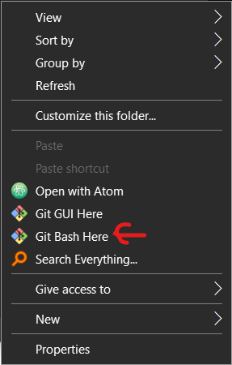

To initialize the repo, run this command

```bash
git init
```

### Using existing Repository

The method is same except the creation part. Navigate to the local Repo folder inside Git Bash.

Use this command to check current status.

```bash
git status
```

## Scenario 2: Creating/Using GitHub created new/existing Repository.

### Creating new GitHub Repository.

Click/Tap [here](www.github.com/new) to create a new GitHub Repository.

Or open your GitHub profile and create from there.

After creating, Copy the Web URL (ending with .git)
_In this picture, it is not showing completely. Just use that copy button._
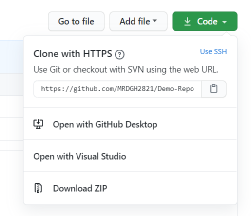

And use the command

```bash
git clone <url>
```

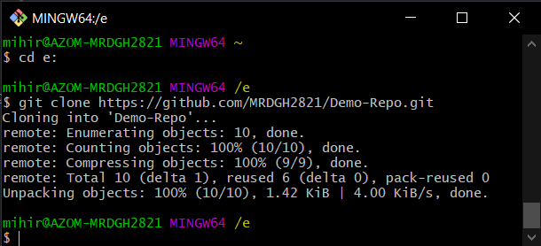

**Note:** After cloning, you need to enter into the local repo folder. Use `dir` command to list all the folders present. Use `cd` command to enter inside your repo.

### Using existing GitHub Repository.

Open your GitHub profile and Instead of creating a new Repo, open the repo where you wish to upload your code.<br>

Rest of the steps are same as above.<br>

## _Common steps_

### Adding files & other stuff

There are few Linux terminal commands which work in Git Bash. And some Windows CMD commands too. In the above screenshots you can observe that `dir` is Windows CMD command & it works. 

Equivalent Linux terminal command is `ls`. <br><br>
My point is, you can use the usual Linux terminal command to navigate & copy files.<br><br>
For the sake of simplicity, I will not be using terminal/CMD commands to copy files. I will be using Windows File Explorer to copy the files, Atom Text editor to edit them & finally Git Bash to commit changes.<br>

I will be using both the repos - <br>
`Demo-repo`  (This one is hosted on GitHub)<br>
`Gitbash repo` (This one is locally created Repo)<br>
To show how it is done.<br>

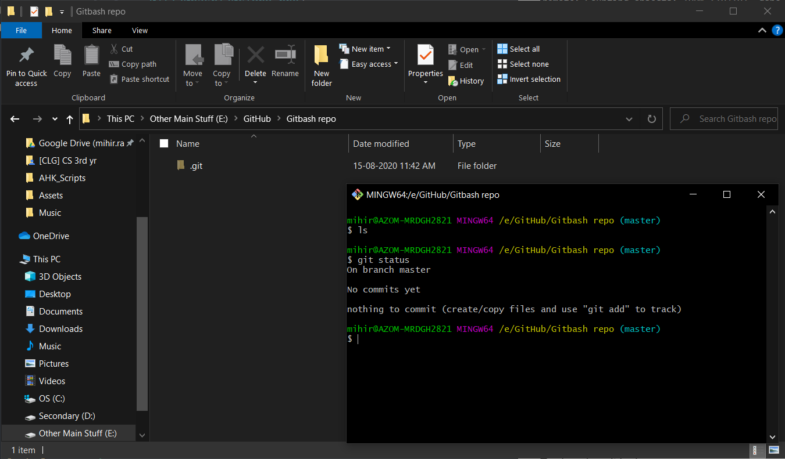

#### Staging the Files

After Adding a sample text file -<br>
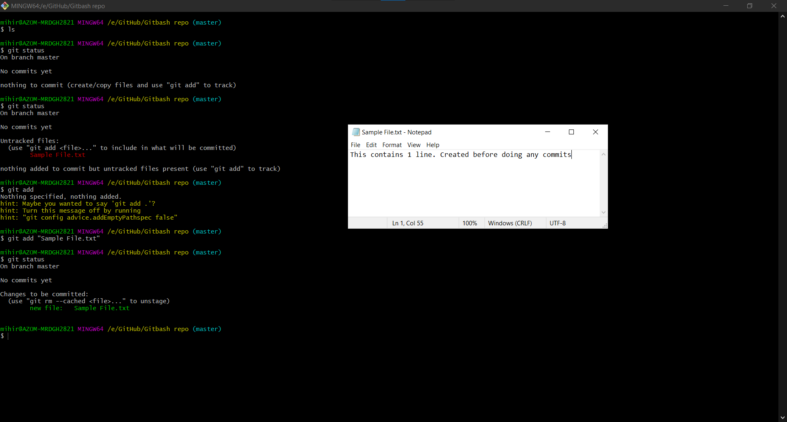<br><br>
The new files are currently unstaged. We need to move them to staging area where we can commit them & push the changes.<br>

As you can see in the screenshot, the command for adding/Staging files for tracking is -<br>

```bash
git add <complete file name>
```

The file name should be enclosed in quotation marks if it contains any spaces.

Simply putting the command yields this result-<br>

```bash
Nothing specified, nothing added.
```

_Pro tip_ - Use double quotes every time (even if there are no spaces in filename) to prevent any headaches & errors. In this way it is guaranteed that your file will be taken as input properly.<br>

Repeat this command for all the files/folders you copied to the repo.<br>

_Pro tip_ - To stage all new files, folders & subfolders use the following.<br>

```bash
git add -A
```

 _Or_

```bash
git add -all
```

#### Committing the Files

After staging them, check using `git status` to see how many files are being currently being staged.<br>
In my case there's only one file currently staged.
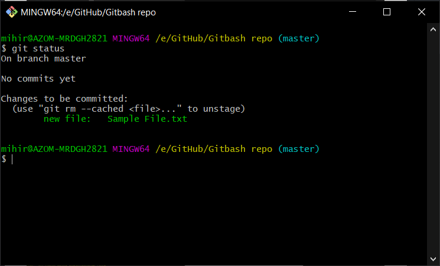

To commit the changes use this command -<br>

```bash
git commit -m "<type a meaningful message here>"
```

For example -<br>

```bash
git commit -m "Added sample file"
```

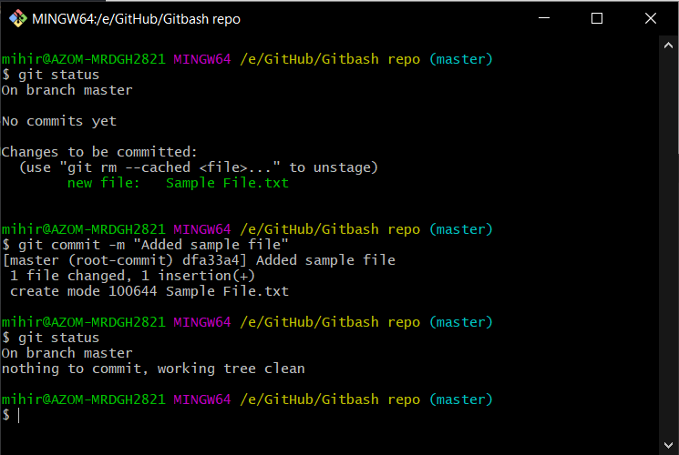
<br>

_Pro tip_ - Incase you want to commit all new & modified files, use this command -

```bash
git commit -a -m "<type a meaningful message here>"
```

### Pushing Commits to Remote Repository

Remote means situated away from local.
In this context, a prime example would be GitHub Repository.

Here I will be using [Demo-repo](https://github.com/MRDGH2821/Demo-Repo).
Which is a GitHub Repo.

I have done 2 changes.

1.  Add new file.
2.  Modify existing file.

Here are the commands which I executed.<br><br>
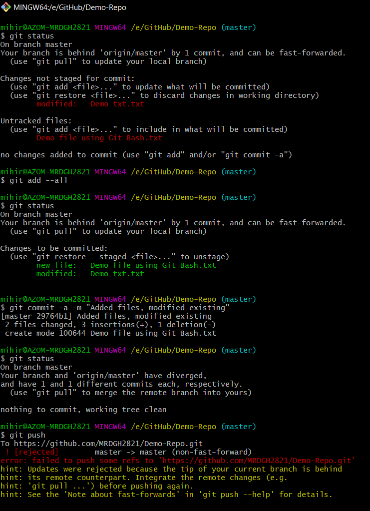<br><br>
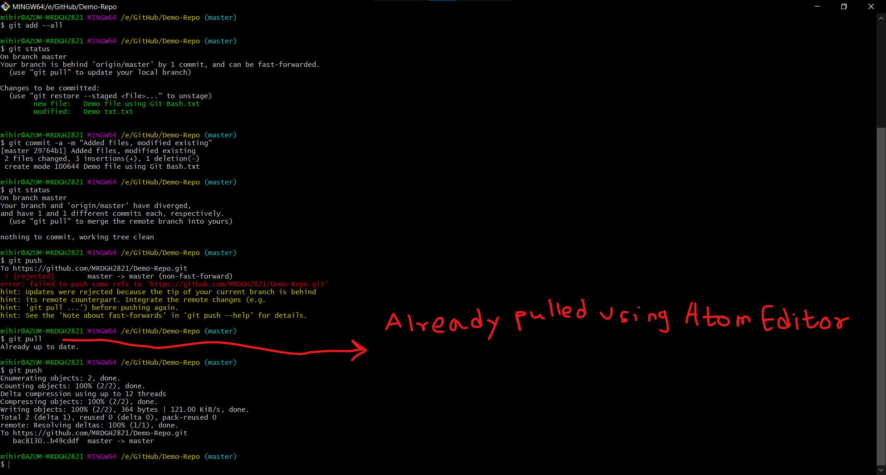
<br>

After making all commits, I have used this command to push the commits to remote Repository -<br>

```bash
git push
```

As you can see in the screenshot, the remote branch was ahead of my local repo. So I have to pull all the commits/changes in to my local repo after which I can push my commits -<br>

```bash
git pull
```

#### Setting Remote Repository for Local Repository

Focus: GitBash Repo

When you will try executing `git push` command on locally created repo, Git Bash will report the following.<br>

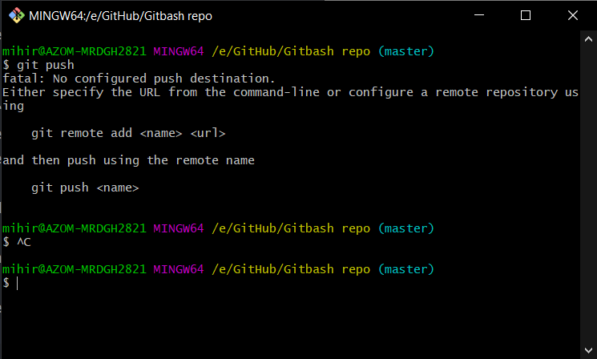

To set a remote Repository, we need name & URL.<br>
And then we need to execute the following command

```bash
git remote add <name> <url>
```

The above command follows the generic syntax of git remote add <name> <repository url>

-   Add: To add a new URL to the repository.
-   Name: To give a name that you will use instead of the URL of the repository.
-   URL: The URL of the repository.

To get the URL, refer "Creating new GitHub Repository" section. Once you copy the URL execute the command.

I will demonstrate using `Gitbash Repo`

1.  First I create a new GitHub repository [here](www.github.com/new)


<br>
After creating the repo, GitHub will show a quick setup page.
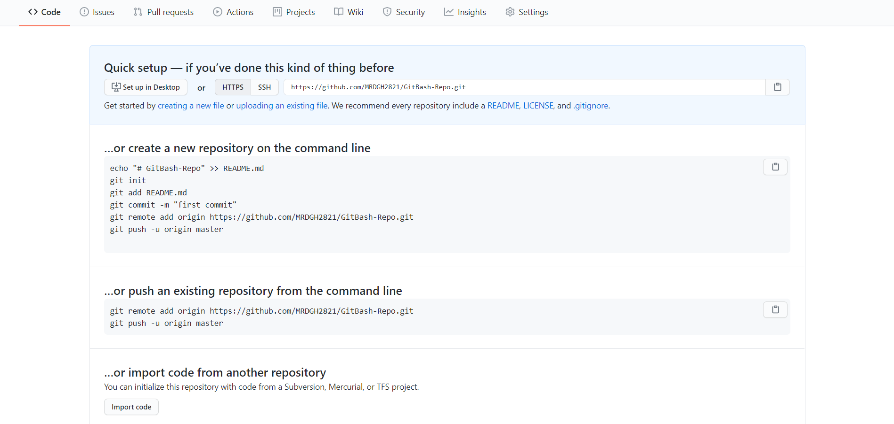

2.  To make things easier, copy the commands present at<br> `…or push an existing repository from the command line`

And execute it in Git Bash.
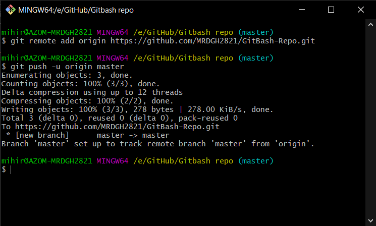

3.  To check whether the commits have been pushed successfully (even though Git Bash tells you though)<br>
    Open your GitHub repository and see for yourselves!

In my case, the repo had only 1 file - `Sample File.txt`

And on GitHub it shows like this -<br>


That's all!
