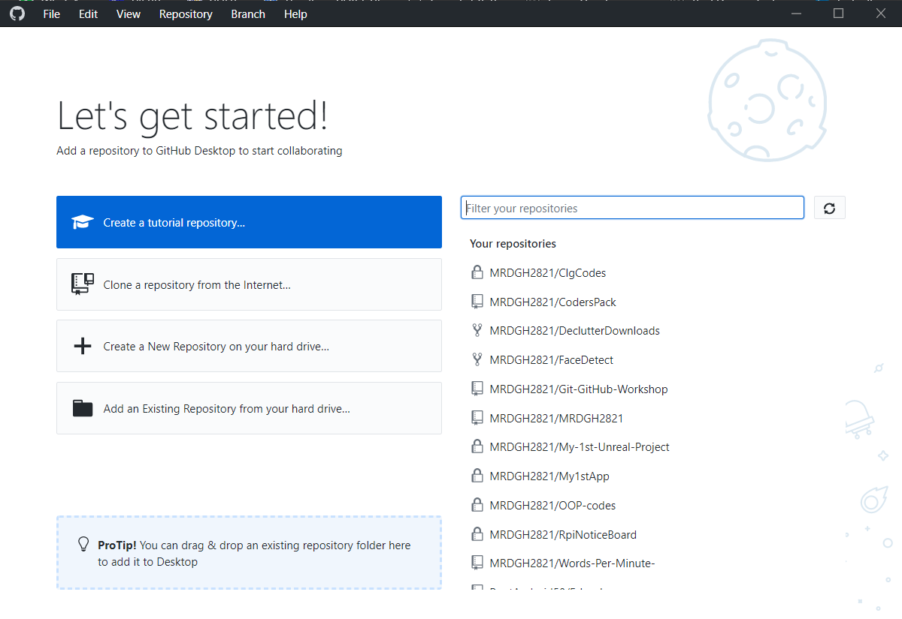
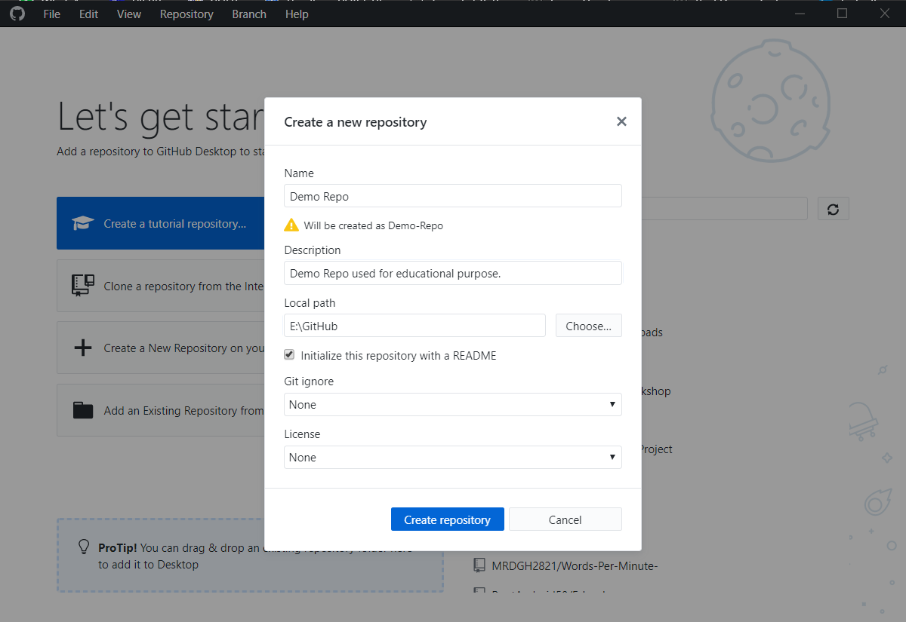
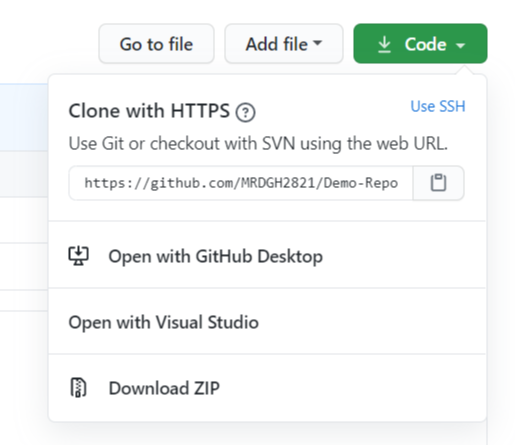
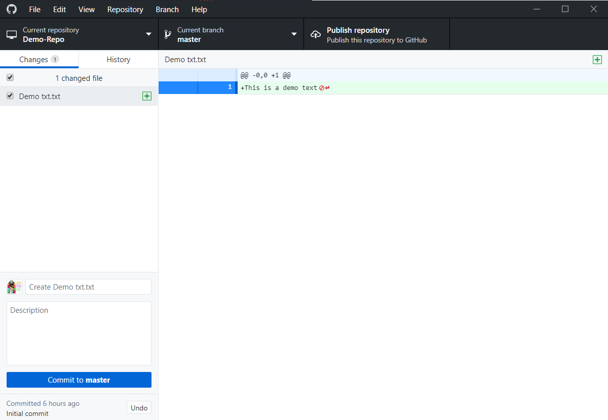
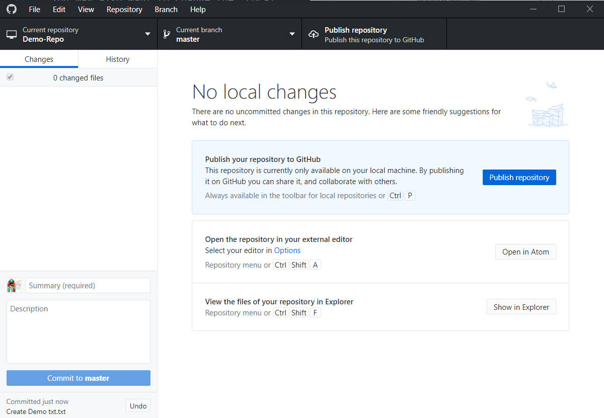
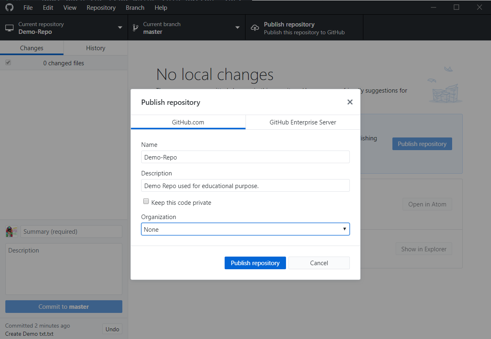
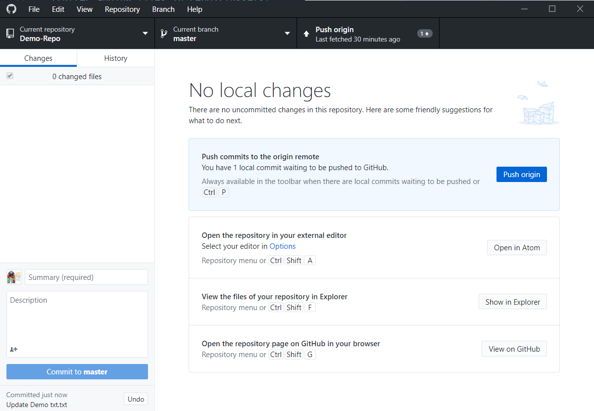

# Creating a Repository Using GitHub Desktop

After you Sign in to GitHub Desktop you will see this screen.

 

Lets create a new Repository. 
Click on the 2nd option. 
`Create a New Repository on your hard drive` 

Enter the name, a brief description and done!
You may also want to change the "Local path"

 

### Using Existing Repository instead of creating New

Suppose You created a repo in GitHub already. And you want to use that one.
 Open the repo online & do the following -   
  
Click on `Open with GitHub Desktop`
 

##### Or 

You can add existing local repo by clicking on `Add an existing Repository from hard drive`  

 

#### Adding files & other stuff

Now, open the repo using this button - 
`Show in Explorer`  
  

Copy your files into the repo "folder" 
GitHub Desktop will automatically detect the changes you made. 
In my case I will add a demo text file.  

  
Write a meaningful summary in the small text box just above Description. And add description too. Then Commit to master! 
(Or whatever branch you are in)

#### Publishing the Repository

_If you created the repo locally_  
After copying all the files, its time to Publish your repo to GitHub!

  
You may want to keep this settings while publishing the repo.  

#### Pushing to the Repository

_If you cloned the repo, or made changes after publishing repo_  

Instead of `Publish Repository` you will see `Push Origin` button.  Click on it and all the commits are now being pushed to Remote Repository!  
