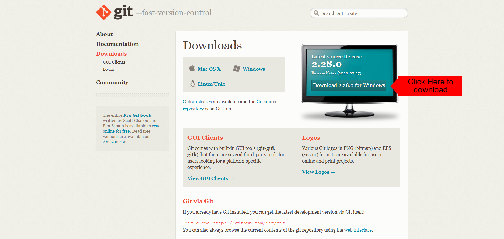
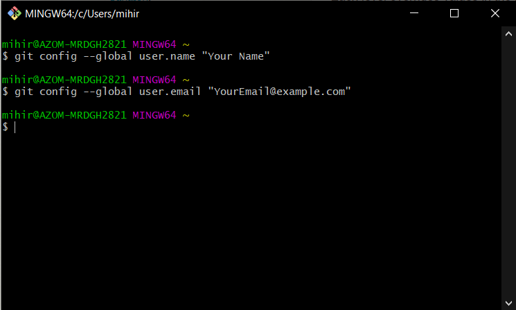

# Downloading Git Version Control

Head over to this [Site](https://git-scm.com/download)<br>
Click on the button as shown here in this picture.<br>


This will download Git version Control for your operating system.<br>
If you are on Windows, it will download Windows version<br>
If you are on Mac OS if will download Mac OS version<br>

# Installing Git Version Control

After downloading the setup, install it.

While Installing you might run through the following option -<br>


Select whichever editor you are using, for this tutorial I will be using Atom editor as my default.<br>

### Configuring Git Using Git bash

[The first thing you should do when you install Git is to set your user name and email address. This is important because every Git commit uses this information, and it’s immutably baked into the commits you start creating.](https://git-scm.com/book/en/v2/Getting-Started-First-Time-Git-Setup)<br><br>
Open Git Bash and run the following commands. Make sure that you put your name & email while executing these commands.

```bash
git config --global user.name "John Doe"
git config --global user.email johndoe@example.com
```

<br><br>
You can rerun the command if you happen to make any mistakes. We are humans after all & bound to mistake somewhere or other!<br>

_Pro Tip:_ it would be wise to set default editor **again** using Git Bash. Click [here](https://git-scm.com/book/en/v2/Appendix-C%3A-Git-Commands-Setup-and-Config#_core_editor) to see which command to run.
While making commits, if you forget to put message, it will launch the editor which you have set. By default it launches Vi, which is difficult to use.
