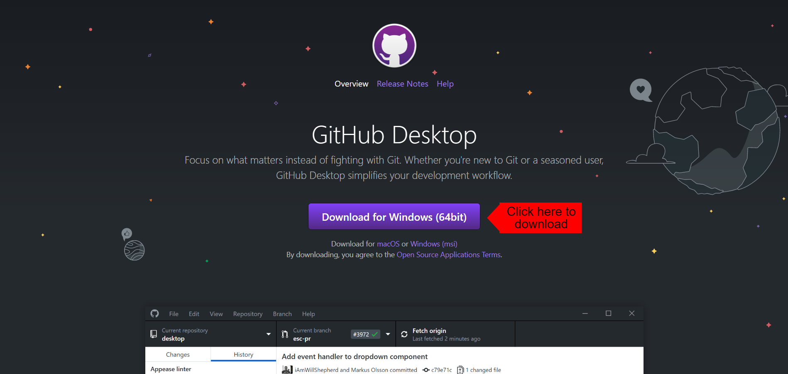
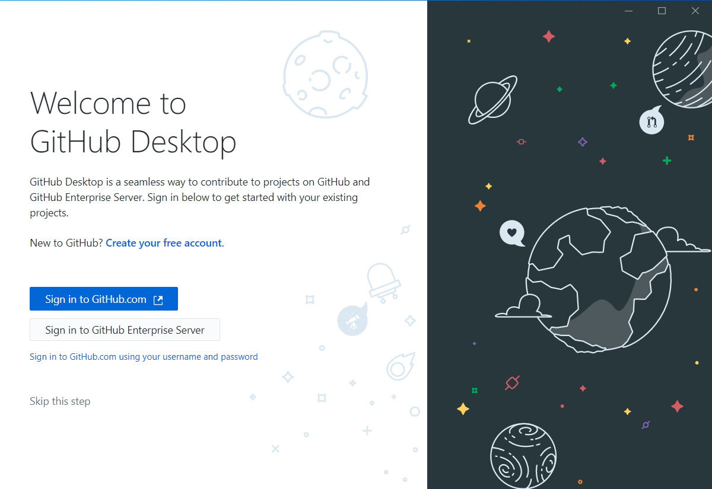
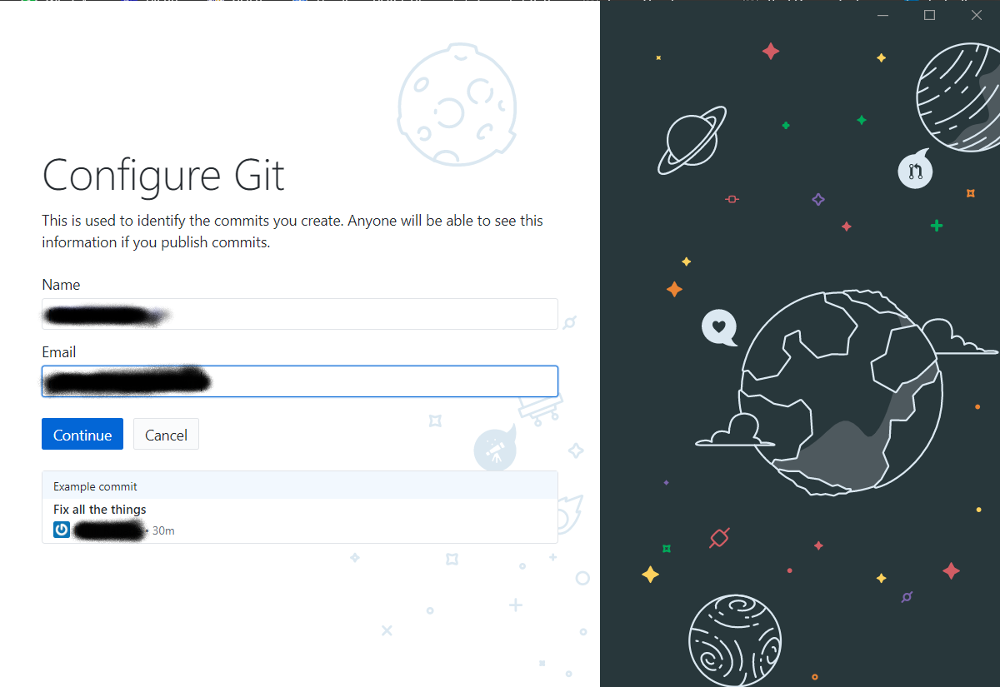

# Downloading GitHub Desktop

Head over to this [Site](https://desktop.github.com/) 
Click on the button as shown here in this picture. 

This will download GitHub Desktop for your operating system. 

# Installing GitHub Desktop

Open the installer, on Windows it will show like this - 

After installing, Sign in to your GitHub Account. You can make one [Here](https://github.com/join?ref_cta=Sign+up&ref_loc=header+logged+out&ref_page=%2F&source=header-home)

### Configuring Git inside GitHub Desktop

After Signing in, you will see the below screen. 
Enter your Real Name or Username & your Email ID. 

